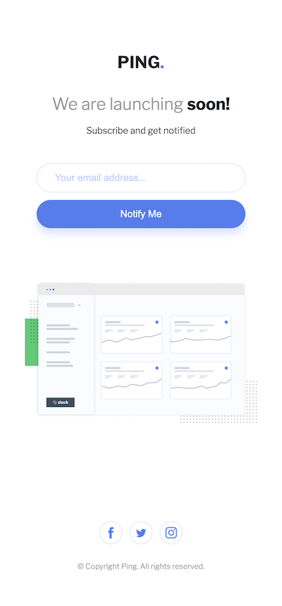

This is a solution to the Ping single column - Coming Soon page

## Table of contents

- [Overview](#overview)
  - [Screenshot](#screenshot)
  - [Links](#links)
- [My process](#my-process)
  - [Built with](#built-with)
  - [What I learned](#what-i-learned)
  - [Continued development](#continued-development)
- [Author](#author)

## Overview

Comming soon page with the layout depending on device's screen size.
Include email input to subscribe.
Hover state on a submit email button, also to the social media icons.
Different error messages in 2 cases:

- input field is empty
- email address is formatted incorretly (symbols@symbols.symbols)
  Otherwise a popup window of a successful subscribtion.

### Screenshot

#### Desktop version of layout

#### Little tablet and mobile layout

### Links

- Live Site URL: https://comming-soon-nadiafr.netlify.app/

## My process

### Built with

- Semantic HTML5 markup
- SASS architecture (sass variables, @mixins ..)
- Flexbox
- Hover effect on media icons and call to action button
- EventListener on a button to check the correct format of the email using JavaScript

### What I learned

- SASS architecture for little card projects
- How to apply the fontawesome icons
- Different error messages positioned in connection to an input field

### Continued development

Form application and submitting

## Author

Nadia Furzikova - front-end developer,
based 📍 Nancy/France
